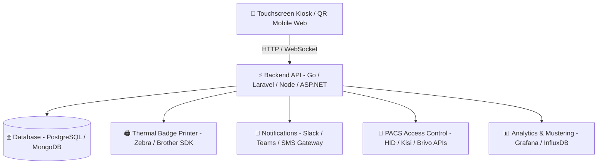

# Awesome-Visitor-Management-System 🏢✨

 

      

  <strong>Curated Directory of Top Visitor Management Systems (VMS), Lobby Check-In Software &amp; Open-Source Projects</strong>
   
  <em>Digital Reception • QR &amp; Photo Badges • Host Alerts (Slack/Teams/SMS) • Compliance &amp; NDA Signatures • Physical Access Control</em>
   
  🕒 Last updated: August 2026

---

## 📖 Overview & Ecosystem Guide

A **Visitor Management System (VMS)** streamlines and secures how workplaces, corporate enterprises, industrial plants, government facilities, and schools welcome guests. By replacing paper logbooks with touchless kiosks and automated digital workflows, modern VMS solutions deliver:

- 🪪 **Digital Check-In & Badging**: Pre-registration links, instant QR check-in, photo capture, and automated badge printing (Brother, Zebra, Dymo).
- 🔔 **Instant Host Notifications**: Real-time alerts to hosts via Slack, Microsoft Teams, SMS, and Email upon guest arrival.
- 📜 **Security & Compliance**: Electronic NDA/waiver e-signatures, GDPR/CCPA audit logging, health screening, and watchlist/blocklist cross-referencing.
- 🚪 **Physical Access Control (PACS) Integrations**: Automatic gate and door badge activation (HID, LenelS2, Brivo, Kisi, Genea).
- 🚨 **Emergency Safety & Mustering**: Real-time roll-call evacuation lists accessible from mobile devices during incidents.

---

## 📑 Table of Contents
- [🏢 SaaS & Hosted Platforms](#-saashosted-platforms)
- [💻 Open-Source GitHub Projects](#-open-source-github-projects)
- [🛠️ Frameworks & Architecture Guide](#️-frameworks--architecture-guide)
- [🤝 How to Contribute](#-how-to-contribute)
- [📈 Star History](#-star-history)
- [⚠️ Disclaimer](#️-disclaimer)

---

## 🏢 SaaS/Hosted Platforms

> Sorted in **descending order** by company scale (Valuation / Revenue / Parent Market Cap).

| Platform | Description | Company Scale & Valuation / Revenue | Starting Pricing | Free Tier / Trial Limits |
| :--- | :--- | :--- | :--- | :--- |
| **[HID Visitor Manager](https://www.hidglobal.com/products/hid-visitor-manager)** | Enterprise-grade cloud visitor management from HID Global focused on PACS hardware, access control badges, large-group flows, and government-level compliance. | **Parent: ASSA ABLOY (~$30B+ Market Cap)** • ~$14B+ Group Revenue (HID Global division ~$1.5B+ ARR) | Base cloud subscription starts at **$2,500 / year** per site (or perpetual workstation packages from **$1,000**) | **30-day proof-of-concept / guided trial** in authorized partner demo environment (no permanent free tier) |
| **[Proxyclick (Eptura Visitor)](https://www.eptura.com/)** | Cloud enterprise visitor platform with customized check-in flows, pre-registration, badge printing, watchlist screening, and IWMS suite integrations. | **Parent: Eptura (~$2.5B+ Valuation)** • Backed by Thoma Bravo &amp; JMI Equity (~$266M+ Annual Revenue) | Essential tier starts at **$100 / location / month** (billed annually) | **15-day free trial** with access to core visitor check-in features (no permanent free tier) |
| **[Envoy](https://envoy.com/products/visitors)** | Industry-standard workplace visitor management with iPad check-in, photo badges, NDA signing, host notifications (Slack/Teams/email), and access control. | **~$1.4 Billion Valuation (Unicorn)** • ~$80.5M ARR (backed by Andreessen Horowitz, Menlo Ventures) | Free Basic plan ($0); Standard tier starts at **$109 / location / month** (billed annually) | **Free forever plan**: Up to 100 visitor entries/month (includes host notifications and employee directory; excludes badge printing/NDAs); plus 14-day free trial on paid tiers |
| **[Traction Guest / Sign In Solutions](https://www.signinsolutions.com/)** | Compliance-first enterprise visitor management for highly regulated industries with advanced screening, watchlists, custom forms, and multi-site policies. | **Parent: Sign In Solutions (~$350M+ Valuation)** • Backed by PSG Equity (~$50M+ Group Revenue) | Enterprise entry packages start at **$300 / location / month** (billed annually) | **15-day sandbox trial / proof-of-concept** with pre-configured guest compliance workflows (no permanent free tier) |
| **[The Receptionist](https://thereceptionist.com/)** | Intuitive iPad-based visitor check-in system with customizable badge printing, two-way host messaging (SMS/Slack/Teams), and SMB focus. | **~$40.6 Million Valuation** • ~$13.5M ARR (merged with Sign In App family) | Core tier starts at **$49 / month** ($630 / site / year billed annually) | **15-day free trial** with full feature access and unlimited check-ins for 1 location (no credit card required) |
| **[SwipedOn](https://www.swipedon.com/)** | User-friendly visitor and employee sign-in system featuring kiosks, photo capture, digital ID badges, evacuation mustering, and multi-tenant support. | **~$36 Million Valuation (£28.35M M&A)** • ~$10.5M ARR (acquired under SmartSpace / Sign In Solutions) | Starter tier starts at **$49 / location / month** (billed annually) | **14-day free trial** with full platform features for 1 location/device (no credit card required) |
| **[Sign In App](https://signinapp.com/)** | Compliance-oriented visitor management with digital sign-in, guest screening, badge printing, multi-location logs, and GDPR/audit features. | **~$30 Million+ Valuation** • ~$12M ARR (part of Sign In Solutions portfolio) | Core tier starts at **$52.50 / month** ($630 / site / year billed annually) | **15-day free trial** with full feature access, unlimited staff & visitor entries for 1 site (no credit card required) |
| **[Eden Workplace](https://www.edenworkplace.com/visitor-management)** | Modular visitor management platform offering guest pre-registration, iPad kiosk check-in, NDA e-signing, badge printing, and Slack/Teams alerts. | **~$20 Million+ Valuation** • ~$10M Annual Revenue ($40M total venture funding raised) | Visitor Management module starts at **$59 / location / month** (billed annually) | **14-day guided free trial / sandbox demo** upon request (no permanent free tier) |
| **[Archie](https://archieapp.co/)** | Hybrid office visitor management combined with desk booking, meeting room scheduling, iPad/Android kiosks, and workplace analytics. | **~$15 Million Valuation** • Seed/Series A stage (~$3.5M ARR) | Standalone Visitor Management starts at **$109 / location / month** (or $159/month bundled) | **14-day free trial** with unlimited visitor check-ins and kiosk access for 1 location |
| **[Veris Welcome](https://www.getveris.com/veris-visitor-management)** | Touchless enterprise visitor platform with facial-recognition check-in, e-passes, host alerts, watchlists, and smart parking integration. | **~$8 Million Valuation** • Series A stage (~$2M Annual Revenue) | Base entry tier starts at **$50 / terminal / month** (annual contract) | **14-day pilot / demo sandbox** for 1 facility with up to 100 test visitor entries (no permanent free tier) |

---

## 💻 Open-Source GitHub Projects

> Ranked in **descending order** by GitHub Star count. Badges link directly to each repository's stargazers page.

| Project & Repository | Star Count | Tech Stack | Key Features & Highlights |
| :--- | :--- | :--- | :--- |
| **[neozhu/visitormanagement](https://github.com/neozhu/visitormanagement)** |  | .NET 8 • C# • MudBlazor • Clean Architecture | Full-featured enterprise web portal for visitor check-in, employee host directories, photo capture, thermal badge printing, e-signatures, SMS/Email alerts, and analytics dashboards. |
| **[AmitXShukla/Visitor-Management-App](https://github.com/AmitXShukla/Visitor-Management-App)** |  | Angular 13 • Node.js • Express • MongoDB (MEAN) | Complete electronic visitor logging application with responsive Angular frontend, host scheduling, guest database management, and token-based authentication. |
| **[COS301-SE-2022/Intelligent-VMS-Visitor-Management-System-](https://github.com/COS301-SE-2022/Intelligent-VMS-Visitor-Management-System-)** |  | TypeScript • Angular • NestJS • Python AI Engine | Intelligent residential & corporate VMS with AI visitor pattern analytics, resident invite passes, parking verification, and real-time lobby monitoring. |
| **[sanjeev662/visitor-management-system-react](https://github.com/sanjeev662/visitor-management-system-react)** |  | React • Node.js • Express • MongoDB | Role-based visitor access portal supporting separate workflows for Administrators, Receptionists, Security Guards, and Host Employees. |
| **[tcedi/tcedi-ovms](https://github.com/tcedi/tcedi-ovms)** |  | PHP • Apache License 2.0 • MySQL • Touch Kiosk | Open-source kiosk check-in system with virtual touchscreen keyboard, optional NDA signing, direct badge printing, receptionist live board, and audit reports. |
| **[shubhamkumar27/Django-Visitor-Management-System](https://github.com/shubhamkumar27/Django-Visitor-Management-System)** |  | Python • Django • SQLite/PostgreSQL • Twilio SMS | Python Django visitor log portal with SMS arrival alerts, host check-out timestamps, query filters, and clean admin reporting interface. |
| **[Xanik/VMS](https://github.com/Xanik/VMS)** |  | Go (Golang) • HTML5/JS • SQLite | High-performance Go-based visitor service featuring employee host registration, guest visit codes, automated email/SMS alerts, and lightweight footprint. |
| **[ParshwaS/VMS](https://github.com/ParshwaS/VMS)** |  | Node.js • Express • MongoDB • WhatsApp Bot | Automated visitor check-in system featuring WhatsApp bot pre-registration, QR code entry passes, security guard scanner app, and admin analytics. |
| **[prodstarter/frontdesk](https://github.com/prodstarter/frontdesk)** |  | Laravel 10 • Filament PHP • Tailwind CSS • Livewire | Elegant modern front-desk portal with instant check-in, visitor status tracking, customizable screening questionnaires, and GDPR compliance tools. |
| **[nikramakrishnan/visitor-management](https://github.com/nikramakrishnan/visitor-management)** |  | PHP • MySQL • Bootstrap | Lightweight visitor tracking log with admin authentication, guest details logging, meeting purpose tracking, and historical search records. |
| **[mkotson/receptio](https://github.com/mkotson/receptio)** |  | Python • OpenCV • Flask • WebRTC | Autonomous digital receptionist with face detection greeting, webcam photo badges, electronic visitor logbook, and Mailchimp integration. |
| **[P0etInc0de/VisitorPortal](https://github.com/P0etInc0de/VisitorPortal)** |  | Laravel • Blade • OpenID Connect • PDF Badging | Production-ready visitor portal with host pre-registration, reception check-in/out, PDF badge generator, welcome display screen, MFA, and OIDC SSO. |
| **[gerardocipriano/VisiTrack-VisitorManagement](https://github.com/gerardocipriano/VisiTrack-VisitorManagement)** |  | ASP.NET Core • Entity Framework • Vue.js • SignalR | Real-time facility check-in/check-out system powered by SignalR web-sockets for instantaneous security desk synchronizations. |
| **[chttrjeankr/visitor-management-system](https://github.com/chttrjeankr/visitor-management-system)** |  | Python • Flask • MongoDB • HTML5 | Minimalist lobby registration portal capturing host details, automated check-in/out timestamps, and MongoDB dashboard view. |
| **[Varunyadavgithub/WRL-Visitorpass](https://github.com/Varunyadavgithub/WRL-Visitorpass)** |  | React • Node.js • Express • MongoDB • JWT | Full-stack gate pass system with JWT security, QR-based A4 printable passes, photo uploads, and live gate monitoring for manufacturing plants. |
| **[blankcry/visitor-management-system](https://github.com/blankcry/visitor-management-system)** |  | React • Node.js (Express) • PostgreSQL | Modular visitor registry with PostgreSQL storage, authentication, visitor tracking, and employee meeting association. |
| **[ElectrifyCS/Geofencing-for-Visitor-Management-Systems](https://github.com/ElectrifyCS/Geofencing-for-Visitor-Management-Systems)** |  | Python • Kalman Filter • GPS Analytics • Scikit-Learn | Location-verification engine for high-security facilities that prevents GPS spoofing via anomaly detection, Kalman filtering, and RFID sensor correlation. |
| **[MashuAjmera/Visitor-Management](https://github.com/MashuAjmera/Visitor-Management)** |  | Node.js • Express • MongoDB • EJS | Entry management system for co-working offices with host check-ins, guest logging, and automated notification triggers. |

---

## 🛠️ Frameworks & Architecture Guide

Building your own custom on-premise or cloud visitor kiosk? Here is the recommended architecture stack:

- **Frontend / Kiosk UI**: Flutter, React, Vue, or Blazor running in Chrome Kiosk Mode / iPad Guided Access.
- **Badge Printing**: Zebra Link-OS SDK, Brother b-PAC SDK, or PDF rasterization via WebUSB/ESC-POS.
- **Host Communications**: Webhooks for Slack App API, Microsoft Graph API, Twilio SMS, and SendGrid/Postmark.
- **Physical Access**: OSDP (Open Supervised Device Protocol), Wiegand interfaces, and cloud PACS REST APIs.
- **AI & Security**: OpenCV for face capture/verification, Ollama/LLM for smart host resolution, and blocklist matching.

---

## 🤝 How to Contribute

We welcome contributions from the community! To suggest a new SaaS product, open-source project, or update existing information:

1. 🍴 **Fork** this repository.
2. 🌿 **Create a branch**: `git checkout -b add-my-visitor-tool`
3. 📝 **Add/Update entries**:
   - For SaaS tools: include platform name, URL, 1–2 sentence description, company valuation/scale, starting price, and free tier/trial limit.
   - For Open-Source repos: include repo link, social star badge, tech stack, and key feature summary.
4. 🚀 **Commit your changes**: `git commit -m 'Add awesome visitor system'`
5. 📬 **Submit a Pull Request** with a brief summary of the project.

---

## 📈 Star History

---

## ⚠️ Disclaimer

- This is a **community-curated** list — not an official endorsement of any vendor or repository.
- Visitor management software handling personal identifiable information (PII) must comply with local privacy regulations (e.g., GDPR, CCPA, HIPAA).
- Self-hosted open-source solutions require appropriate security hardening, data backup strategies, and physical hardware maintenance.

---

  Made with ❤️ for office managers, workplace technologists, security teams, and facility directors.

